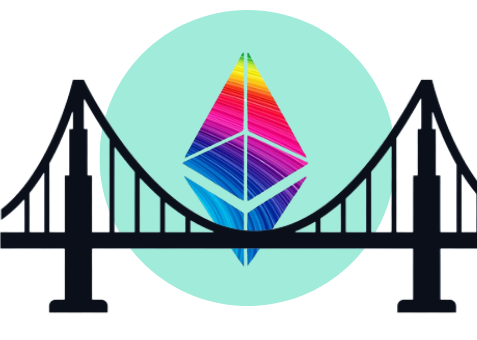

<div align="center" style="margin-bottom:40px">
  <a href="/">
    <br/>
  </a>
  <h1 align="center">ValueBridge</h1>
  <b>A conditon-based value bridge and saving-vault</b>
</div>

---

This contract acts both as a middle man between someone that wants to send you value/ether and your ethereum wallet, and also as a saving-box for you the owner. It imposes a minimum amount of ether that can be sent to you, and also saves some of ethers sent to you, which you can withdraw later but only if it's up to the minimum withdrawal amount.

### Deployment
To deploy the contract, setup your hardhat config file to suit your preffered process of deployment and deployment blockchain network. 

Also note that this contract requires constructor arguments for deployment. The `constructorArgs` variable in `scripts/deploy.ts` file contains precoded default arguments which you're to change to your preference.
_ownerName: string, _minTransferAmt: BigNumberish, _minWithdrawAmt: BigNumberish`
#### Constructor Arguments:
Arguments passed when deploying.
- **`_ownerName:string`** Name of the deployer
- **`_minTransferAmt: BigNumberish`** The minimum amount of ether (in wei) that can be sent to you through the contract. The contract rejects the transfer if the sent ether is not up to this value.
- **`_minWithdrawAmt: BigNumberish`** The minimum amount of ether (in Wei) the contract should save (have as balance) before the deployer is able to make withdrawals.

When everything is set, run the following command to deploy with your hardhat configurations
```shell
npx hardhat run ./scripts/deploy.ts
```

### What next 🤷‍♂️ 
The next thing to do is to simply hand over the deployed contract's address to anyone that wants to send you funds; the contract will take of the rest. 🤸‍♂️🤸‍♀️

### Interaction
The compiled contract's ABI facilitates interaction with the contract. Also, this contract is completely type-safe, so you get auto-suggestions of the contract methods when writing interaction logics within the project.

This project is open to collaborations and contributions. You can also buy me a coffee ☕☕